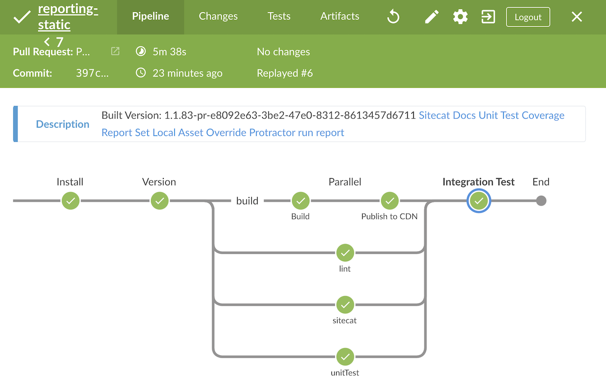
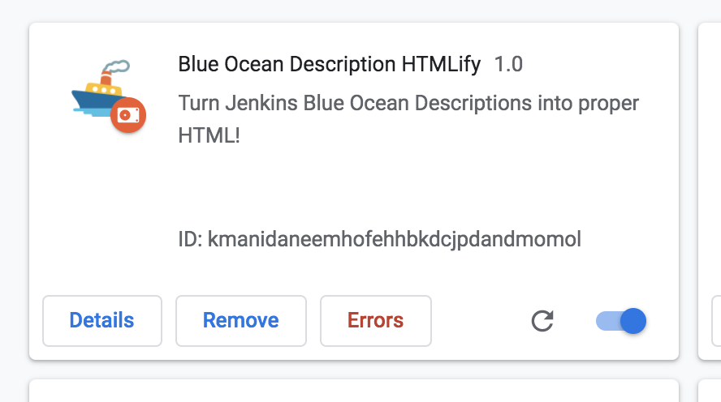

# Blue Ocean Description HTMLify

<p align="center">

<br/>
Turn Jenkins Blue Ocean Descriptions into proper HTML
</p>

### Preview



### Installation

Install it from the chrome extension store here: https://chrome.google.com/webstore/detail/blue-ocean-description-ht/maahpenodjcdhodbonmdkfgnceddigae


### Local Installation

1. Clone or [Download](https://github.com/JRJurman/blue-ocean-description-htmlify-chrome-extension/archive/master.zip) the project onto your local machine

```
git clone https://github.com/JRJurman/blue-ocean-description-htmlify-chrome-extension.git
```

2. Open the extensions management page for your browser, most likely [chrome://extensions/](chrome://extensions/)

3. Select `Load unpacked` at the top left, and select the package folder. It should now appear in your extensions with the appropriate icon and description



_Icon from https://emojipedia.org/google/android-4.4/ship/_
